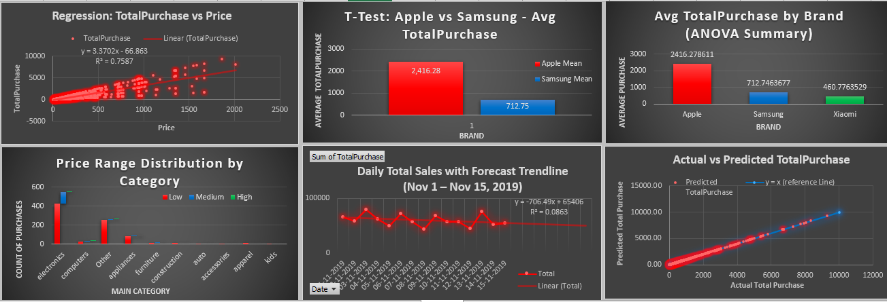

# 📊 Excel + VBA Statistical Analysis Portfolio Project

This Excel-based portfolio project demonstrates deep knowledge of statistical concepts, hypothesis testing, regression, and predictive modeling, enhanced with **Excel formulas** and **VBA macros**. The dataset, visualizations, and custom automation illustrate hands-on statistical thinking.

---

## 📁 Dataset Overview

- 📅 **Date Range:** Randomized between `2019-11-01` and `2019-11-15`
- 🧾 **Records Used:** 993 cleaned purchase transactions
- ➕ **Additions for Realism:**
  - `Quantity` column (randomized integers from 1 to 5)
  - `TotalPurchase = Price × Quantity`
- 🗂️ **Category Cleanup:** Used only **main category** (first part of `category_code`) for Chi-Square test

---

## 📈 Summary Statistics

| Metric           | Value        |
|------------------|--------------|
| Mean             | 902.63       |
| Median           | 460.70       |
| Mode             | 256.84       |
| Standard Dev.    | 1264.41      |
| Variance         | 1,598,740.31 |
| Minimum          | 7.72         |
| Maximum          | 9303.45      |
| Range            | 9295.73      |

---

## 📉 Regression Analysis

### 🔹 Simple Linear Regression  
**TotalPurchase ~ Price**

| Metric              | Value     |
|---------------------|-----------|
| Slope               | 3.37      |
| Intercept           | -66.86    |
| R² (Goodness of Fit)| 0.7587    |
| Correlation (R)     | 0.8710    |
| Equation            | `y = 3.37x - 66.86` |

✅ Interpretation: TotalPurchase is strongly correlated with Price.

---

### 🔹 Multiple Linear Regression  
**TotalPurchase ~ Price × Quantity**  
Using `LINEST()` for prediction modeling

| Metric                          | Value          |
|---------------------------------|----------------|
| Slope (PxQ coefficient)         | 1              |
| Intercept                       | 1.25056E-12    |
| Standard Error (slope)          | 3.13E-17       |
| Standard Error (intercept)      | 4.87E-14       |
| R² (Goodness of Fit)            | 1              |
| Standard Error of y-estimate    | 1.25E-12       |
| **Model Equation**              | `PredictedPurchase = 1*(Price × Quantity) + 1.25E-12` |

✅ Conclusion: Perfect model fit, as expected due to definition of TotalPurchase = Price × Quantity.

---

## 🧪 Hypothesis Testing

### 🔸 T-Test: Apple vs Samsung

| Metric             | Apple Mean | Samsung Mean | p-value     |
|--------------------|------------|--------------|-------------|
| Average TotalPurchase | 2416.28     | 712.75       | 7.27E-31    |

✅ Result: Significant difference in customer spend behavior.

---

### 🔸 ANOVA: Apple, Samsung, Xiaomi

| Source           | SS           | df | MS           | F        | p-value        | F crit |
|------------------|--------------|----|--------------|----------|----------------|--------|
| Between Groups   | 361,060,721  | 2  | 180,530,361  | 117.70   | 2.13E-42       | 3.01   |
| Within Groups    | 743,872,249  | 485| 1,533,757    |          |                |        |
| Total            | 1,104,932,971| 487|              |          |                |        |

✅ Result: At least one brand has significantly different average purchase.

---

### 🔸 A/B Test (via T-Test): Apple vs Samsung

- This A/B test compares **Apple vs Samsung** customer spend using an independent two-sample t-test.
- Same test logic, repeated as a real-world experiment setup.

**p-value:** `7.26672E-31`  
✅ Highly significant difference in spending behavior between the two customer groups.

---

### 🔸 Chi-Square Test: Main Category vs Price Range

- Price ranges were bucketed into Low, Medium, High
- 10 Main Product Categories derived using text-to-columns
- All expected frequencies ≥ 5

**Chi-Square p-value:** `5.24442E-08`  
✅ Strong association between category and price band.

---

## 📈 Forecasting & Trend Analysis

### 🔹 Daily Sales Forecast

- Linear regression on total purchases across randomized purchase dates
- Equation: `y = 706.49x + 65406`  
- R² = 0.0863

🔎 Interpretation: Trend exists, but weak — indicative of short-term fluctuation.

---

## 📊 Visualizations

Charts were created in Excel using consistent styling, branded coloring, trendlines, and data labels.

- Regression: TotalPurchase vs Price
- T-Test: Apple vs Samsung
- ANOVA: Avg TotalPurchase by Brand
- Chi-Square: Price Range by Category (stacked bar)
- A/B Testing: Visual reuse of T-Test
- Daily Forecast: Line chart with trendline
- Predictive Model: Actual vs Predicted Purchase



---

## 💻 Tools & Techniques

- **Excel Functions:** `T.TEST`, `CHISQ.TEST`, `ANOVA`, `LINEST`, `FORECAST`, `IF`, `COUNTIFS`, `AVERAGE`, `PIVOT TABLE` etc.
- **VBA Macros:** Summary stats automation, regression modeling, p-value calculations
- **Power Query:** Data cleanup, filtering, and transformation
- **Data Visualization:** Custom charting, axis formatting, trendline overlays

---

## 📝 Notes & Assumptions

- `Quantity` values were added randomly to simulate realistic volume (1–5).
- `TotalPurchase` was computed via `Price × Quantity`
- Purchase dates were randomized for time-based forecasting
- Main category only used in Chi-Square (parsed from full category path)
- Duplicate rows, missing values, and outliers were cleaned prior to analysis
- Where applicable, both **Excel formula** and **VBA-based approaches** were implemented and compared

---

## 📂 Repository Structure

```bash
📁 Excel-Statistician-Portfolio-Project/
├── Sales_Statistics_Analysis.xlsx
├── README.md
├──  charts_summary_statistical_analysis_excel_vba_project.png

